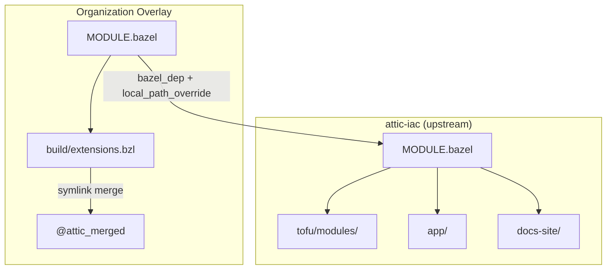
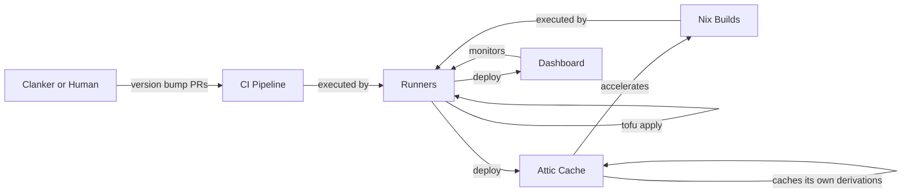

# Glorious Flywheel

Self-deploying infrastructure that builds, caches, and monitors itself.

## What is this?

A set of OpenTofu modules, Nix packages, and a SvelteKit monitoring dashboard that
form a recursive infrastructure system for Gitlab.  GitLab runners deploy themselves as a HPA runner pool, the Nix
binary cache caches its own derivations, bazel overlay orchestrates intra enterprise deployments,
intra enterprise automations (such as your companies pool of autonmous clankers, Steve, RenovateBot or your manager checking in every now and again)
all running on infrastructure managed by this code.  I think its kinda neat.

## Architecture

Two-module Bzlmod architecture: a public upstream repository (this one) and private
overlay repositories that add organization-specific configuration.



## Components

- **Attic binary cache** -- S3/MinIO storage, CloudNativePG PostgreSQL, automatic GC
- **GitLab runners** -- 5 types (docker, dind, rocky8, rocky9, nix) with HPA autoscaling
- **Runner dashboard** -- SvelteKit 5 + Skeleton v4 monitoring UI with drift detection
- **Documentation site** -- SvelteKit + mdsvex + Mermaid, deployed to GitHub/GitLab Pages



## Quick Start

Prerequisites: Nix with flakes, kubectl, direnv

```bash
# Enter development shell
direnv allow

# Configure your organization
cp config/organization.example.yaml config/organization.yaml

# Set up secrets
cp .env.example .env
# Add TF_HTTP_PASSWORD (GitLab PAT)

# Deploy
just tofu-plan attic
just tofu-apply attic
```

See [docs/infrastructure/quick-start.md](docs/infrastructure/quick-start.md) for the
full deployment guide.

## Project Structure

```
attic-iac/
  app/                  # Runner dashboard (SvelteKit 5 + Skeleton v4)
  docs/                 # Documentation (Mermaid diagrams, no ASCII art)
  docs-site/            # Documentation site (SvelteKit + mdsvex + adapter-static)
  tex_research/         # Research document (LaTeX)
  tofu/
    modules/            # Reusable OpenTofu modules
    stacks/             # Deployment stacks
  config/               # Organization configuration
  k8s/                  # Kubernetes manifests
  nix/                  # Nix packaging
  build/                # Bazel overlay system
  scripts/              # Build and deploy scripts
```

## Documentation

Full documentation is available at the [docs site](https://jesssullivan.github.io/attic-iac/)
or in [docs/](docs/index.md).

Key topics:
- [Recursive Dogfooding](docs/architecture/recursive-dogfooding.md) -- the core concept
- [Bzlmod Topology](docs/architecture/bzlmod-topology.md) -- two-module system
- [Greedy Build Pattern](docs/build-system/greedy-build-pattern.md) -- build fast, cache everything
- [Runner Selection](docs/runners/runner-selection.md) -- which runner to use
- [OpenTofu Modules](docs/reference/tofu-modules.md) -- all modules documented

## Development

```bash
just dev               # Start dashboard dev server
just docs-dev          # Start docs site dev server
just check             # Run all validations
just app-test          # Run dashboard tests
just tex               # Build research PDF
```

## Creating an Overlay

To deploy attic-iac for your organization:

1. Create a new repository with `MODULE.bazel` declaring `bazel_dep(name = "attic-iac")`
2. Add `local_path_override(path = "../attic-iac")` for local development
3. Create `build/extensions.bzl` to merge upstream with your overrides
4. Add organization-specific `config/organization.yaml` and stack tfvars
5. Set up CI pipeline that clones upstream and runs tofu plan/apply

See [docs/architecture/overlay-system.md](docs/architecture/overlay-system.md) for details.

## License

Apache 2.0
