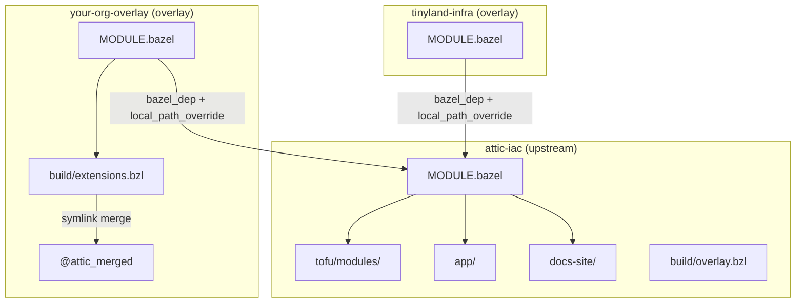

# Bzlmod Topology

This document describes the two-module Bzlmod architecture that separates
public upstream infrastructure from private institutional overlays.

## Overview

The system is split into two layers:

1. **attic-iac** -- the public upstream module containing shared OpenTofu
   modules, the SvelteKit application, documentation site, and build
   tooling.
2. **Overlay modules** (your-org-overlay, tinyland-infra) -- private
   repositories that depend on the upstream module and extend or override
   its contents for a specific deployment.

Each overlay declares a `bazel_dep` on `attic-iac` and uses
`local_path_override` to point Bazel at a local checkout of the upstream
repository. This keeps the two repositories as sibling directories on disk
and avoids fetching upstream from a registry.

## Module Dependency Graph



## How Overlays Depend on Upstream

An overlay `MODULE.bazel` contains two declarations:

```starlark
bazel_dep(name = "attic-iac")
local_path_override(
    module_name = "attic-iac",
    path = "../../attic-iac",
)
```

`bazel_dep` registers the upstream module as a dependency.
`local_path_override` tells Bazel to resolve that dependency from a
sibling directory rather than a remote registry. This means any local
edits to the upstream checkout are immediately visible to the overlay
build without publishing or fetching.

## Symlink Merge via @attic_merged

The overlay build tooling (`build/overlay.bzl` and `build/extensions.bzl`)
creates a synthetic repository called `@attic_merged`. This repository is
a symlink-based merge of the upstream and overlay file trees, with
**private-wins-on-conflict** semantics: if both trees contain a file at
the same path, the overlay version is used.

See [Overlay System](overlay-system.md) for the full details of this
merge process.

## Automatic Invalidation

Starting with Bazel 7.1, `ctx.watch_tree()` allows repository rules to
register directory watches. The overlay repository rule watches both the
upstream and overlay source trees. When any file in either tree changes,
Bazel automatically invalidates the `@attic_merged` repository and
re-runs the merge on the next build. No manual cache-clearing is needed.

## pnpm-lock.yaml Constraint

`npm_translate_lock` (from rules_js) processes exactly one
`pnpm-lock.yaml` per Bazel module. Because the SvelteKit application has
its own lockfile, it must live in the upstream module where the lockfile
is declared. Overlays cannot introduce a second lockfile without creating
a second module boundary, so the app source stays in attic-iac and
overlays consume the built artifacts.

This constraint is the primary reason the SvelteKit app is not moved into
the overlay repositories.

## Related Documents

- [Overlay System](overlay-system.md) -- detailed mechanics of the
  symlink merge
- [Multi-Repo Layout](multi-repo-layout.md) -- how the repositories are
  hosted and mirrored
- [Recursive Dogfooding](recursive-dogfooding.md) -- the self-deploying
  property that ties the architecture together
