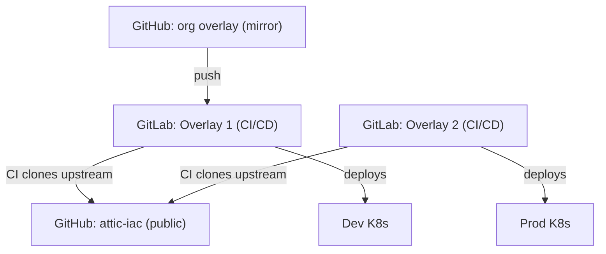

# Multi-Repo Layout

This document describes how the repositories are hosted, mirrored,
and connected through CI/CD pipelines.

## Repository Topology

## The Repositories

### attic-iac (public upstream)

- **Host**: GitHub (`Jesssullivan/attic-iac`)
- **Visibility**: Public
- **Contents**: Shared OpenTofu modules, SvelteKit application source,
  documentation site, Bazel build tooling (`build/overlay.bzl`), and
  Nix flake for container builds.
- **Role**: Single source of truth for all reusable infrastructure
  components. Contains no organizational secrets or deployment-specific
  configuration.

### Organization Overlay (example)

- **Code mirror**: GitHub (optional, for code review and backup)
- **CI/CD**: GitLab (your organization's project)
- **Visibility**: Private
- **Contents**: Organization-specific tfvars, runner configurations,
  `organization.yaml`, CI pipeline definitions, and any files that
  override upstream defaults.
- **Remotes**:
  - `origin` points to the GitHub mirror (for code review and backup)
  - `gitlab` points to the GitLab project (for CI/CD execution)

Pushes to the GitHub mirror are forwarded to GitLab, which triggers
the CI pipeline.

### Additional Overlays

Additional overlay repositories follow the same pattern. Each targets
a different Kubernetes cluster with its own organization-specific
configuration, while sharing the same upstream modules.

## CI Pipeline Flow

All overlay repositories follow the same CI pattern:

1. A push to the overlay repository triggers a GitLab CI pipeline.
2. The pipeline clones the public upstream repository from GitHub.
3. It symlinks upstream modules and source files into the overlay
   workspace, replicating the `@attic_merged` layout that Bazel
   produces locally.
4. OpenTofu runs `plan` and `apply` against the merged file tree.
5. On the `main` branch, deploys are automatic (not gated by manual
   approval).

This means the CI pipeline does not depend on Bazel itself. It
reproduces the overlay merge with shell-level symlinks, keeping the
CI environment lightweight.

## GitLab Accounts

Each overlay repository is typically managed by a separate GitLab
account (or group):

- Use a dedicated GitLab account or group per organization.
- The account's Personal Access Token (PAT) is used for the OpenTofu
  HTTP state backend.
- SSH keys should be configured per account for Git operations.

## Deployment Targets

- **dev-cluster**: Development Kubernetes cluster. Deployed by the
  overlay's GitLab pipeline.
- **prod-cluster**: Production Kubernetes cluster. Deployed by the
  overlay's GitLab pipeline (or a separate overlay).

All clusters receive the same upstream infrastructure components
(Attic cache, runners, dashboard) but with organization-specific
configuration provided by their respective overlays.

## Related Documents

- [Bzlmod Topology](bzlmod-topology.md) -- how the overlay modules
  depend on upstream via Bzlmod
- [Overlay System](overlay-system.md) -- the symlink-merge mechanics
  that CI replicates
- [Recursive Dogfooding](recursive-dogfooding.md) -- the self-deploying
  property of the deployed infrastructure
