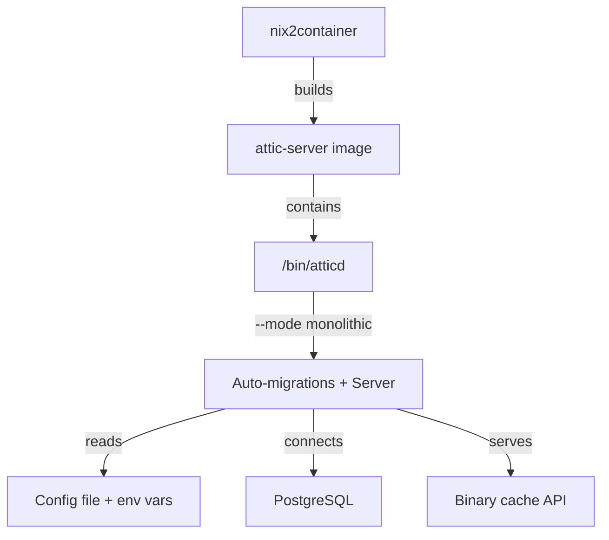
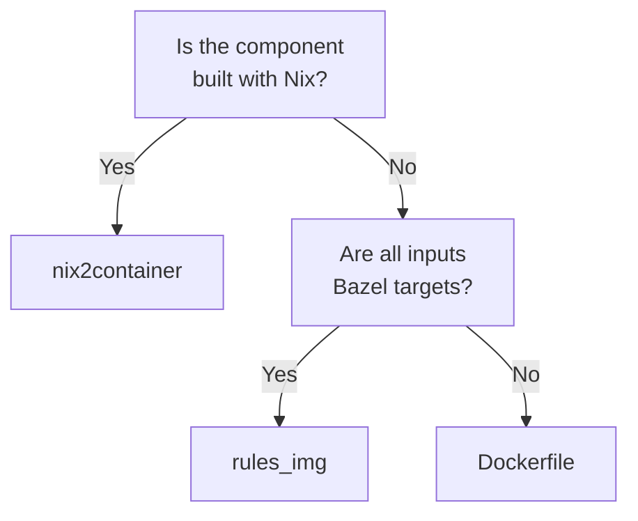

# Container Builds

This project uses three methods for building OCI container images,
selected based on the requirements of each component.

## Build Methods

### nix2container (Preferred)

[nix2container](https://github.com/nlewo/nix2container) builds OCI
images directly from Nix derivations without requiring a Docker daemon.
It is the preferred method for all Nix-based components because it
produces byte-for-byte reproducible images and generates optimized layers
based on the Nix store graph.

Key properties:

- **No Docker daemon required.** Images are assembled from Nix store
  paths. This is critical for CI runners that do not have Docker-in-Docker
  available.
- **Reproducible.** The same Nix inputs always produce the same image
  digest.
- **Optimized layers.** nix2container analyzes the Nix store closure and
  groups paths into layers that minimize redundancy across image versions.
  Shared dependencies (libc, openssl, etc.) land in stable base layers
  that rarely change.
- **Streamable push.** Images can be streamed directly to a registry
  without first writing a tarball to disk.

Usage in this project:

```nix
# Simplified example from flake.nix
packages.attic-server-image = nix2container.buildImage {
  name = "attic-server";
  config = {
    entrypoint = [ "${atticd}/bin/atticd" ];
    cmd = [ "--mode" "monolithic" ];
  };
  layers = [
    (nix2container.buildLayer { deps = [ atticd ]; })
  ];
};
```

### Dockerfile (Fallback)

Standard multi-stage Dockerfiles are used when the component is not
built with Nix or when the build requires a Node.js toolchain that is
simpler to express as Docker stages.

The runner dashboard uses this approach:

- **Stage 1** (`node:20-alpine`): Install pnpm, copy lockfile, install
  dependencies, run `pnpm build` to produce the adapter-node output.
- **Stage 2** (`node:20-alpine`): Copy only the built output and
  production `node_modules`. Set the entrypoint to `node build/index.js`.

The Dockerfile lives at `app/Dockerfile` and can be built with any
standard Docker-compatible tool (Docker, Podman, Buildah).

### rules_img (Bazel-Native)

For components managed entirely within Bazel, the `image_layer` and
`image_manifest` rules from the Bazel ruleset produce OCI images without
shelling out to Docker or Nix. This is used for the SvelteKit application
image target.

Key targets:

- `//app:image` -- assembles the OCI image manifest from Bazel-built
  layers.
- `//app:push` -- pushes the image to the configured registry.

The Bazel approach is useful when the image contents are already Bazel
outputs (JavaScript bundles, static assets) and adding a Nix or Docker
step would introduce unnecessary complexity.

## Container Registries

| Registry | Visibility | Usage |
|---|---|---|
| `ghcr.io/{your-org}` | Public | Upstream images published for general consumption |
| `registry.gitlab.com/{your-group}` | Private | Overlay images, deployment-specific builds |

Images are tagged with both a content-based digest and a mutable `latest`
tag. CI pipelines push to the appropriate registry based on the build
context (upstream vs. overlay).

## Attic Server Container

The Attic cache server runs as a container with the following
characteristics:

- The binary is located at `/bin/atticd` inside the image (not
  `attic-server` or any other name).
- The container must be started with `--mode monolithic` to enable
  automatic database migrations on startup. Without this flag, schema
  changes require a separate migration step.
- The image is built with nix2container for reproducibility.
- Configuration is injected via environment variables and a mounted
  configuration file.



## Choosing a Build Method



- Use **nix2container** when the component is a Nix derivation. This
  gives you reproducibility and daemon-free builds.
- Use **rules_img** when all image contents are Bazel outputs and adding
  Nix would be unnecessary overhead.
- Use **Dockerfile** as a fallback for components that do not fit either
  of the above, or when a standard Docker build is the simplest path.

## Related Documents

- [Greedy Build Pattern](greedy-build-pattern.md) -- how builds are
  triggered and cached
- [Watch-Store Bootstrap](watch-store.md) -- incremental caching of Nix
  derivations used by nix2container
- [Bazel Targets](bazel-targets.md) -- build targets including image
  targets
