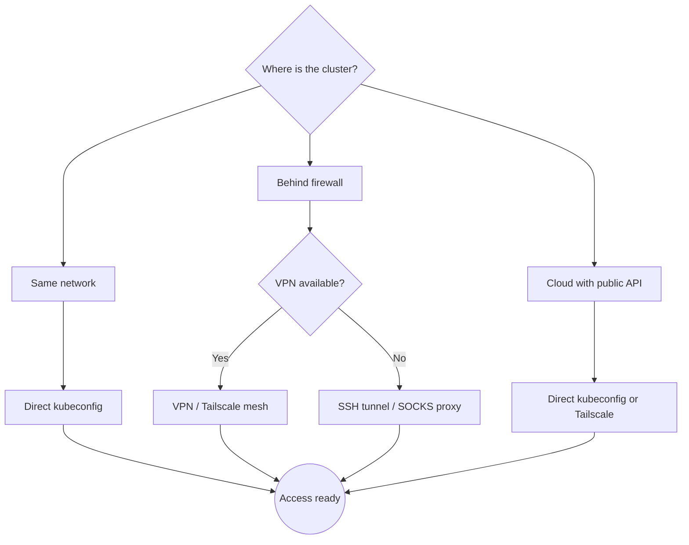

# Cluster Access

Access patterns for Kubernetes clusters running GloriousFlywheel. Choose based on your
network topology and security requirements.



## Direct Kubeconfig

The simplest access method. Works when your machine can reach the cluster API server directly.

```bash
export KUBECONFIG=~/.kube/kubeconfig-{environment}
kubectl get nodes
```

Configure in your overlay Justfile:

```just
# Run kubectl against a specific cluster
bk *ARGS:
    kubectl --kubeconfig=kubeconfig-{environment} {{ARGS}}
```

## VPN / Tailscale Mesh

For clusters behind a firewall, a VPN or Tailscale mesh provides transparent access.

### Tailscale

1. Install the Tailscale operator on the cluster
2. Tag cluster nodes in your Tailscale ACL
3. Access services via Tailscale DNS (`service.namespace.svc.cluster.local`)

### Traditional VPN

Configure your VPN client to route the cluster's pod and service CIDRs through the tunnel.

## SSH Tunnel / SOCKS Proxy

When only SSH access to a jump host is available:

```bash
# Start SOCKS5 proxy through jump host
ssh -fN -D 1080 user@jump-host

# Use the proxy for kubectl
export HTTPS_PROXY=socks5h://localhost:1080
kubectl get pods -n {namespace}
```

Configure in your overlay Justfile:

```just
# Start the SOCKS5 proxy
proxy-up:
    ssh -fN -D 1080 user@jump-host

# Run kubectl through the proxy
bk *ARGS:
    HTTPS_PROXY=socks5h://localhost:1080 kubectl --kubeconfig=kubeconfig-{environment} {{ARGS}}
```

## GitLab Agent (CI/CD)

For CI/CD pipelines, the GitLab Kubernetes Agent provides cluster access without
distributing kubeconfig files.

1. Register an agent in your GitLab project
2. Install the agent Helm chart on the cluster
3. Reference the agent in CI:

```yaml
deploy:
  environment:
    name: dev-cluster
    kubernetes:
      agent: your-group/your-project/agents:dev-cluster
```

The agent handles authentication and authorization. No kubeconfig needed in CI.

## Rancher UI (Optional)

If Rancher manages your cluster, the Rancher UI provides:

- Cluster dashboard and monitoring
- kubectl shell (browser-based)
- User management and RBAC
- Multi-cluster management

Access at `https://rancher.example.com` (requires authentication).

## Access Pattern Summary

| Pattern | Use Case | Requires |
|---------|----------|----------|
| Direct kubeconfig | Same network, cloud public API | Network access to API server |
| VPN / Tailscale | Remote access, multi-site | VPN infrastructure or Tailscale account |
| SSH tunnel | Minimal infrastructure | SSH access to jump host |
| GitLab Agent | CI/CD pipelines | Agent installed on cluster |
| Rancher UI | Management and monitoring | Rancher deployment |
