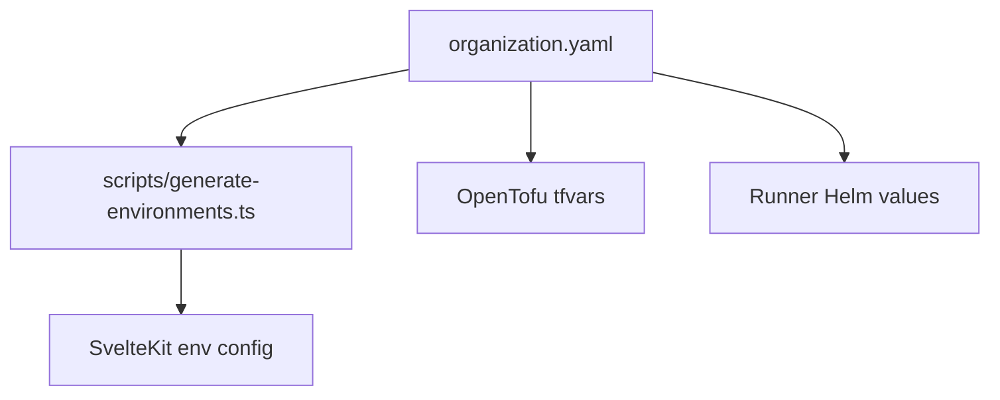

# Customization Guide

All deployment parameters flow from a single file: `organization.yaml` at the repository root. This document explains its structure, how it feeds into the build system, and how overlay repositories extend it.

## organization.yaml as the Single Source of Truth

Rather than scattering configuration across tfvars, Helm values, and application config, this project consolidates everything into `organization.yaml`. Other configuration artifacts are either generated from it or reference it directly.



## Configuration Structure

A representative `organization.yaml`:

```yaml
organization:
  name: acme-corp

environments:
  dev-cluster:
    cluster_context: dev-cluster
    namespaces:
      attic: attic-cache-dev
      runners: acme-corp-runners
      dashboard: runner-dashboard
    cache:
      host: attic.example.com
      storage_class: longhorn
      postgres:
        instances: 1
        storage: 10Gi

  prod-cluster:
    cluster_context: prod-cluster
    # staging/production settings...

runners:
  docker:
    executor: kubernetes
    image: docker:27
    tags: [docker]
  dind:
    executor: kubernetes
    image: docker:27-dind
    tags: [dind, privileged]
    privileged: true
  rocky8:
    executor: kubernetes
    image: rockylinux:8
    tags: [rocky8]
  rocky9:
    executor: kubernetes
    image: rockylinux:9
    tags: [rocky9]
  nix:
    executor: kubernetes
    image: nixos/nix:latest
    tags: [nix]

dashboard:
  oauth:
    provider: gitlab
```

### Top-Level Keys

| Key | Purpose |
|-----|---------|
| `organization.name` | Names the deployment (used in resource labels and state keys) |
| `environments` | Map of cluster environments, each with its own namespaces and settings |
| `runners` | Runner type definitions shared across all environments |
| `dashboard` | Dashboard-specific settings (OAuth provider, theme, etc.) |

### Environment Block

Each environment entry describes a single Kubernetes cluster target:

- `cluster_context` -- the kubeconfig context name (or GitLab Agent path for CI)
- `namespaces` -- maps logical roles (attic, runners, dashboard) to Kubernetes namespace names
- `cache` -- Attic-specific settings: hostname, storage class, PostgreSQL sizing
- Any environment-level overrides for runner resource limits

### Runner Block

Each key under `runners` defines a runner type. The key becomes the runner name. Fields map directly to GitLab Runner Helm chart values. See the "Adding a New Runner Type" section below.

## Environment Config Generation

The script `scripts/generate-environments.ts` reads `organization.yaml` and produces the SvelteKit environment configuration used by the runner dashboard:

```bash
npx tsx scripts/generate-environments.ts
```

This generates TypeScript files under `app/src/lib/config/` that export typed environment metadata, ensuring the dashboard UI stays in sync with the actual infrastructure.

## Overlay Repositories

Overlay repos (such as `your-org-overlay`) contain their own `organization.yaml` that overrides the upstream defaults. The merge strategy is straightforward:

1. The overlay `organization.yaml` is authoritative for all keys it defines.
2. Keys not present in the overlay fall back to the upstream defaults.
3. The Bazel overlay mechanism (`build/overlay.bzl`) handles the file-level merge when building targets.

For OpenTofu, overlays supply their own tfvars files that point to the correct cluster contexts, namespaces, and credentials. The upstream `.tf` module definitions are reused without modification.

## Adding a New Runner Type

1. Add the runner definition to `organization.yaml`:

```yaml
runners:
  # ...existing runners...
  custom-builder:
    executor: kubernetes
    image: your-registry/custom-builder:latest
    tags: [custom-builder]
    run_untagged: false
    cpu_limit: "2"
    memory_limit: "4Gi"
```

2. Create or update the tfvars file for the target environment to include the new runner. Runners in the `{org}-runners` namespace use a self-contained `main.tf` in the overlay, so add the runner resource block there if it is overlay-specific.

3. Plan and apply:

```bash
cd tofu/stacks/gitlab-runners
tofu plan -var-file=../../../tfvars/runners-{environment}.tfvars
tofu apply -var-file=../../../tfvars/runners-{environment}.tfvars
```

4. Verify registration:

```bash
kubectl -n {org}-runners get pods | grep custom-builder
```

The runner should appear as registered in the GitLab group's CI/CD settings.

## Adding a New Environment

1. Add the environment block to `organization.yaml`:

```yaml
environments:
  # ...existing environments...
  new-cluster:
    cluster_context: new-cluster-context
    namespaces:
      attic: attic-cache-prod
      runners: runners-prod
      dashboard: dashboard-prod
    cache:
      host: attic-prod.example.com
      storage_class: default
      postgres:
        instances: 2
        storage: 50Gi
```

2. Create tfvars files for each stack targeting the new environment:

```
tfvars/attic-new-cluster.tfvars
tfvars/runners-new-cluster.tfvars
tfvars/dashboard-new-cluster.tfvars
```

3. Initialize a new backend state for each stack:

```bash
tofu init \
  -backend-config="address=.../terraform/state/attic-new-cluster" \
  # ...
```

4. Follow the [Quick Start](./quick-start.md) deployment order (attic, then runners, then dashboard) using the new tfvars files.

## Related Documentation

- [Quick Start](./quick-start.md) -- end-to-end deployment walkthrough
- [Clusters and Environments](./clusters-and-environments.md) -- namespace layout and auth
- [Proxy and Access](./proxy-and-access.md) -- network connectivity for on-premise clusters
