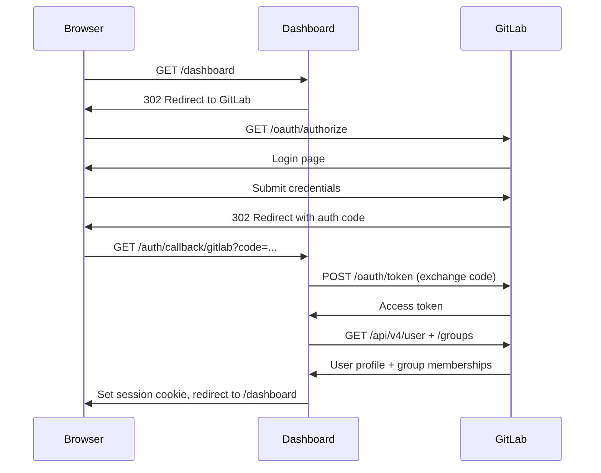
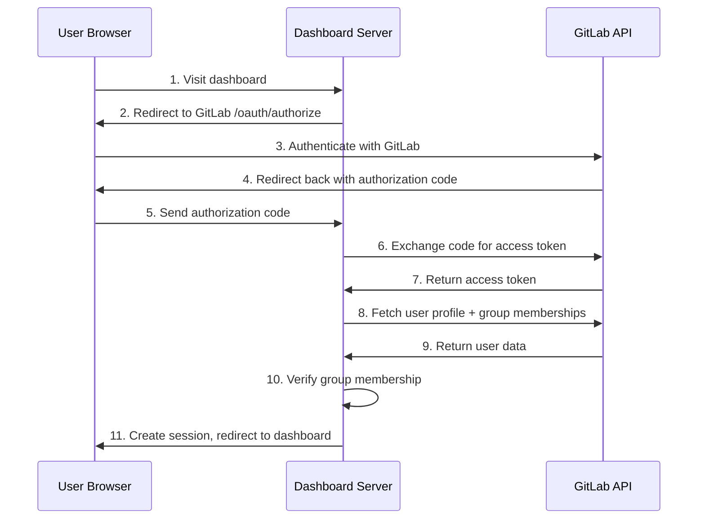

# GitLab OAuth Setup

The runner dashboard uses GitLab as an OAuth provider for authentication. Users sign in
with their GitLab account, and the dashboard verifies group membership for authorization.



## Prerequisites

- A deployed runner dashboard (see [Quick Start](quick-start.md))
- A GitLab account with access to the target group
- HTTPS enabled on the dashboard URL (required for OAuth callbacks)

## Create a GitLab OAuth Application

1. Navigate to your GitLab instance
2. Go to **User Settings** > **Applications** (for personal) or **Group Settings** > **Applications** (for group-level)
3. Fill in the application details:
   - **Name**: `Runner Dashboard` (or any descriptive name)
   - **Redirect URI**: `https://{dashboard-url}/auth/callback/gitlab`
   - **Confidential**: Yes (checked)
   - **Scopes**: Select `read_user` and `openid`
4. Click **Save application**
5. Copy the **Application ID** and **Secret** -- you will need both

Group-level applications are preferred because they restrict sign-in to group members.
User-level applications allow any GitLab user to authenticate (authorization is handled
separately by the dashboard).

## Configure the Dashboard

### Environment Variables

Set these variables in your overlay's CI/CD settings or `.env` file:

| Variable | Description | Example |
|----------|-------------|---------|
| `TF_VAR_gitlab_oauth_client_id` | OAuth Application ID | `09cecd9b...` |
| `TF_VAR_gitlab_oauth_client_secret` | OAuth Secret | `gloas-ca576929...` |

### OpenTofu Configuration

The `runner-dashboard` tofu module creates a Kubernetes secret with the OAuth credentials:

```hcl
variable "gitlab_oauth_client_id" {
  type      = string
  sensitive = true
}

variable "gitlab_oauth_client_secret" {
  type      = string
  sensitive = true
}
```

Pass these via CI/CD variables or `-var` flags:

```bash
tofu apply \
  -var="gitlab_oauth_client_id=$TF_VAR_gitlab_oauth_client_id" \
  -var="gitlab_oauth_client_secret=$TF_VAR_gitlab_oauth_client_secret"
```

### Organization Configuration

In `config/organization.yaml`:

```yaml
dashboard:
  oauth:
    provider: gitlab
    base_url: https://gitlab.com  # or your self-hosted instance
    allowed_groups:
      - your-group
```

## OAuth Flow



## Updating Credentials

If you need to rotate the OAuth secret:

1. Go to the GitLab application settings
2. Click **Renew secret**
3. Update the CI/CD variable `TF_VAR_gitlab_oauth_client_secret`
4. Run `tofu apply` to update the Kubernetes secret
5. Restart the dashboard pod to pick up the new secret

## Troubleshooting

### "placeholder-configure-oauth" in the redirect URL

The dashboard is using placeholder credentials. Set real OAuth credentials per the
configuration section above and redeploy.

### Redirect URI mismatch

GitLab returns "The redirect URI included is not valid." Verify that:

- The redirect URI in GitLab matches `https://{dashboard-url}/auth/callback/gitlab` exactly
- HTTPS is configured (HTTP redirect URIs are rejected)
- No trailing slash mismatch

### 403 after authentication

The user authenticated successfully but is not authorized. Check:

- The user is a member of a group listed in `allowed_groups`
- The OAuth application has `read_user` scope
- Group membership is visible to the application (not hidden by privacy settings)

### Token refresh failures

If sessions expire unexpectedly:

- Verify the OAuth secret has not been rotated without updating the deployment
- Check that the dashboard pod has network access to the GitLab API
