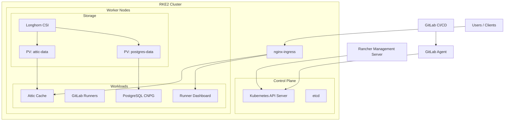
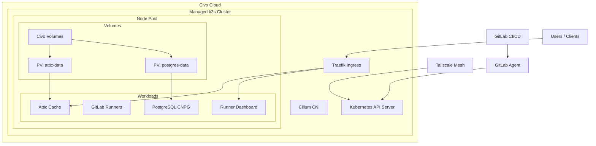

# Tested Deployments

GloriousFlywheel has been tested on two Kubernetes distributions: RKE2 for on-premise
deployments and Civo k3s for cloud deployments. Both support the full stack (Attic cache,
GitLab runners, runner dashboard).

## RKE2 (On-Premise)



RKE2 is Rancher's next-generation Kubernetes distribution, designed for security and
compliance (FIPS 140-2 by default). It runs well on bare metal or VMs behind a corporate
firewall.

### Cluster requirements

- 3+ nodes (control plane + workers), or single-node for development
- Longhorn or another CSI driver for persistent volumes
- Ingress controller (nginx-ingress bundled with RKE2)
- Minimum 4 CPU, 8 GB RAM per worker for a full runner pool

### Provisioning

Install RKE2 on each node per the [RKE2 docs](https://docs.rke2.io/install/quickstart).
For managed provisioning, use Rancher to create and lifecycle the cluster.

### Storage

Longhorn is recommended. Install via Helm:

```bash
helm repo add longhorn https://charts.longhorn.io
helm install longhorn longhorn/longhorn --namespace longhorn-system --create-namespace
```

### Network access

On-premise clusters typically require one of:

- Direct kubeconfig access (same network)
- VPN or Tailscale mesh
- SSH tunnel / SOCKS proxy through a jump host

See [Cluster Access](cluster-access.md) for details.

### GitLab Agent

Register a GitLab Agent for CI/CD access:

1. Create an agent config in your overlay repo under `k8s/agent/`
2. Install the agent via Helm
3. Reference the agent path in your CI pipeline

## Civo k3s (Cloud)



Civo provides managed k3s clusters with fast provisioning (under 2 minutes). Good for
development, staging, and small production workloads.

### Cluster requirements

- Civo account with API key
- Medium nodes (2 CPU, 4 GB) minimum; large (4 CPU, 8 GB) recommended for runners
- Civo CNI (Cilium) and Traefik ingress (default)

### Provisioning

Via Civo CLI:

```bash
civo kubernetes create my-cluster \
  --size g4s.kube.medium \
  --nodes 3 \
  --region NYC1 \
  --save --merge --wait
```

Or via OpenTofu using the Civo provider:

```hcl
resource "civo_kubernetes_cluster" "cluster" {
  name        = "my-cluster"
  region      = "NYC1"
  node_pool {
    size  = "g4s.kube.medium"
    count = 3
  }
}
```

### Storage

Civo provides a default storage class backed by Civo Volumes. No additional setup needed.

### Network access

Civo clusters have public API endpoints by default. For private clusters, use Tailscale:

1. Install Tailscale operator on the cluster
2. Connect from your local machine via Tailscale mesh
3. Access cluster services through Tailscale DNS

See [Cluster Access](cluster-access.md) for details.

### GitLab Agent

Same agent registration process as RKE2. The Civo cluster's public endpoint simplifies
agent connectivity.

## Comparison

| Feature | RKE2 | Civo k3s |
|---------|------|----------|
| Provisioning time | 30-60 min | ~2 min |
| Cost | Your hardware | ~$60/month (3 medium nodes) |
| Storage | Longhorn (self-managed) | Civo Volumes (managed) |
| Network | Firewall/VPN required | Public endpoint |
| Compliance | FIPS 140-2 | Standard |
| Best for | Production, air-gapped | Development, staging |
