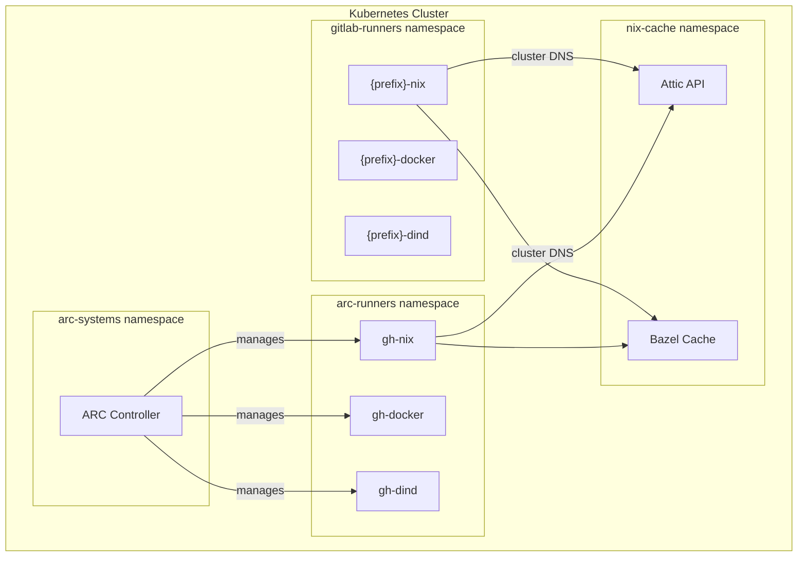

# Runners Overview

GloriousFlywheel provides a cross-forge runner pool that serves both
GitLab CI and GitHub Actions from the same Kubernetes cluster. Six runner
types are deployed across two scaling models.

## Runner Types

| Runner | Forge | Scaling | Base Image | Privileged | Use Case |
|--------|-------|---------|-----------|------------|----------|
| `{prefix}-docker` | GitLab CI | HPA | Alpine | No | General CI jobs |
| `{prefix}-dind` | GitLab CI | HPA | Alpine + Docker | Yes | Container builds |
| `{prefix}-nix` | GitLab CI | HPA | NixOS | No | Reproducible builds |
| `gh-docker` | GitHub Actions | ARC | Alpine | No | General CI jobs |
| `gh-dind` | GitHub Actions | ARC | Alpine + Docker | Yes | Container builds |
| `gh-nix` | GitHub Actions | ARC | NixOS | No | Reproducible builds |

## Scaling Models

**GitLab runners** use Kubernetes HorizontalPodAutoscalers (HPA) with
configurable min/max replicas and CPU-based scaling. Runners are always
warm with at least one replica.

**GitHub Actions runners** use ARC (Actions Runner Controller) scale sets
with scale-to-zero. Runner pods are created on demand when a workflow job
matches the `runs-on` label and terminated after the job completes.

## Namespace Layout

## Common Properties

- **Cache integration**: All runners access the Attic Nix binary cache and
  Bazel remote cache via cluster-internal DNS. No Ingress or credentials
  required for cache access.
- **Infrastructure as Code**: Deployed via OpenTofu modules in
  `tofu/modules/gitlab-runner/` and `tofu/modules/arc-runner/`.
- **Nix integration**: Nix runners auto-configure `ATTIC_SERVER` and
  `ATTIC_CACHE` environment variables for transparent binary cache access.

## Further Reading

### GitLab CI Runners

- [Runner Selection Guide](runner-selection.md) -- how to choose the right runner
- [Docker Builds](docker-builds.md) -- Docker-in-Docker configuration
- [Nix Builds](nix-builds.md) -- Nix flake and Attic cache patterns
- [HPA Tuning](hpa-tuning.md) -- autoscaler configuration
- [Self-Service Enrollment](self-service-enrollment.md) -- onboard your project

### GitHub Actions Runners

- [GitHub Actions Runners](github-actions.md) -- ARC setup, composite actions, cache integration

### Operations

- [Security Model](security-model.md) -- privilege and access boundaries
- [Troubleshooting](troubleshooting.md) -- common issues and fixes
- [Runbook](runbook.md) -- operational procedures
- [Resource Limits](resource-limits.md) -- job pod resource limits reference
