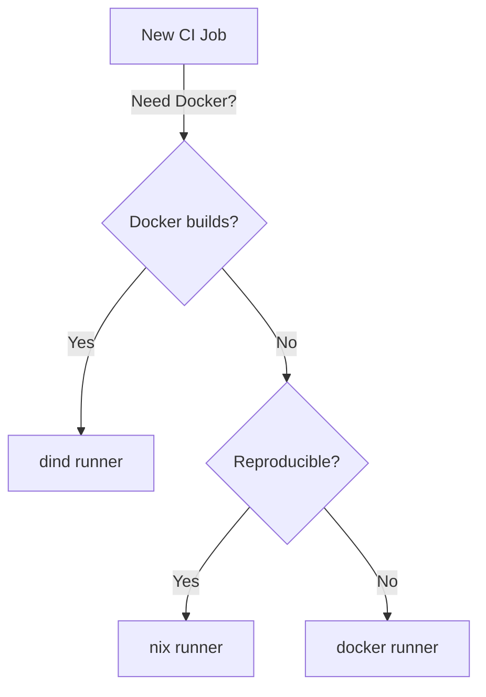

# Runner Selection Guide

Choose the smallest runner that meets the requirements of your CI job.
Lighter runners start faster and consume fewer cluster resources.

## Decision Tree

## Runner Capabilities

Three runner types are available on both GitLab CI and GitHub Actions:

| Type | Base Image | Privileged | Docker Builds | Package Manager | Use Case |
|------|-----------|------------|---------------|-----------------|----------|
| docker | Alpine | No | No | apk | General CI: linting, testing, builds |
| dind | Alpine + Docker | Yes | Yes | apk | Container image builds |
| nix | NixOS | No | No | nix | Reproducible builds with Attic cache |

## Selecting a Runner

- **Default choice**: `docker`. Lightweight Alpine base with the fastest
  startup time. Suitable for most CI jobs that do not have special
  requirements.
- **Need Docker builds?** Use `dind`. This runner is privileged and provides
  a Docker-in-Docker sidecar. See [Docker Builds](docker-builds.md) for
  configuration details.
- **Need reproducible builds?** Use `nix`. Flakes are enabled and the Attic
  binary cache is pre-configured. See [Nix Builds](nix-builds.md) for the
  recommended pipeline pattern.

## GitLab CI Tags

Use these tags in your `.gitlab-ci.yml` to select a runner:

| Primary Tag | Runner | When to Use |
|-------------|--------|-------------|
| `docker` | `{prefix}-docker` | Default for most jobs |
| `dind` | `{prefix}-dind` | Jobs requiring Docker daemon |
| `nix` | `{prefix}-nix` | Nix flake builds |

Additional tags (`linux`, `amd64`, `flakes`, `privileged`) are available
for finer matching but the primary tag is sufficient for most use cases.

## GitHub Actions Labels

Use these `runs-on` values in your GitHub Actions workflows:

| Label | Runner | When to Use |
|-------|--------|-------------|
| `tinyland-docker` | gh-docker | Default for most jobs |
| `tinyland-dind` | gh-dind | Jobs requiring Docker daemon |
| `tinyland-nix` | gh-nix | Nix flake builds |

See [GitHub Actions Runners](github-actions.md) for composite actions
and cache integration details.

## Performance Tip

Always use the smallest runner that meets your needs. The `docker` runner
has the lowest overhead and fastest pod scheduling. Reserve `dind` for jobs
that genuinely require a Docker daemon, and `nix` for jobs that benefit from
Nix's reproducibility guarantees and binary cache.
