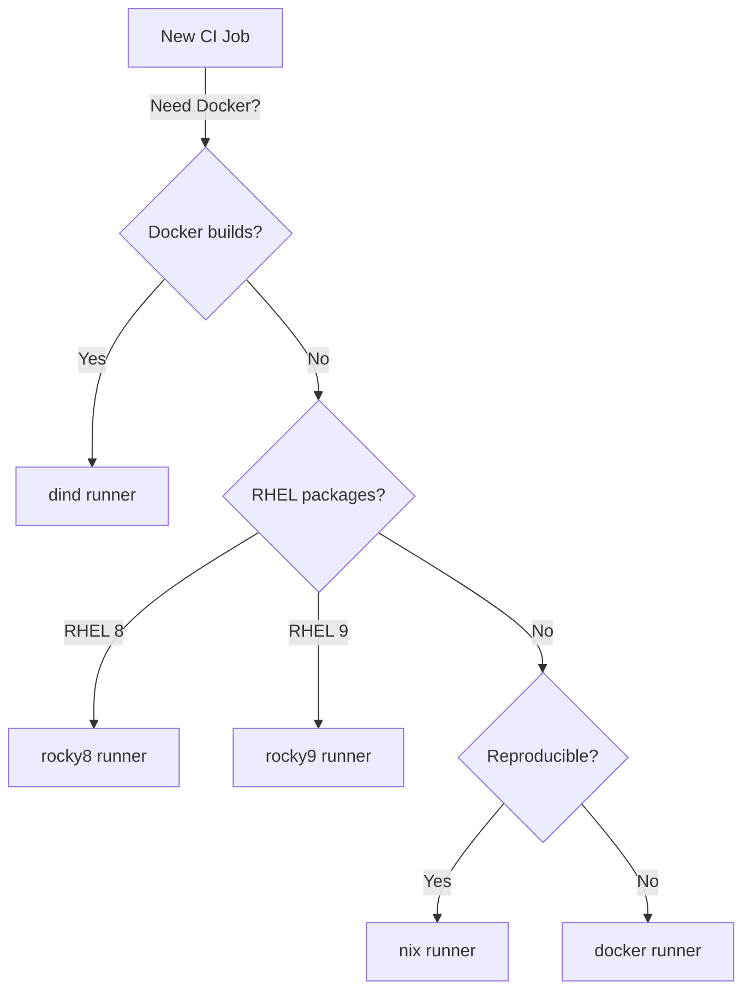

# Runner Selection Guide

Choose the smallest runner that meets the requirements of your CI job.
Lighter runners start faster and consume fewer cluster resources.

## Decision Tree

## Guidelines

- **Default choice**: `docker`. Lightweight Alpine base with the fastest
  startup time. Suitable for most CI jobs that do not have special
  requirements.
- **Need Docker builds?** Use `dind`. This runner is privileged and provides
  a Docker-in-Docker sidecar. See [Docker Builds](docker-builds.md) for
  configuration details.
- **Need RHEL packages?** Use `rocky8` or `rocky9`, matching the target
  operating system version. These runners provide `dnf` and glibc at the
  version your packages expect.
- **Need reproducible builds?** Use `nix`. Flakes are enabled and the Attic
  binary cache is pre-configured. See [Nix Builds](nix-builds.md) for the
  recommended pipeline pattern.

## Runner Tags

Use these tags in your `.gitlab-ci.yml` to select a runner:

| Runner | Tags |
|--------|------|
| docker | `docker` |
| dind | `dind`, `privileged` |
| rocky8 | `rocky8` |
| rocky9 | `rocky9` |
| nix | `nix`, `flakes` |

## Tag Semantics

Each tag maps to exactly one runner type. Use the **primary tag** for runner selection:

| Primary Tag | Runner | When to Use |
|-------------|--------|-------------|
| `docker` | bates-docker | Default for most jobs |
| `dind` | bates-dind | Jobs requiring Docker daemon |
| `rocky8` | bates-rocky8 | RHEL 8 / EL8 packaging |
| `rocky9` | bates-rocky9 | RHEL 9 / EL9 packaging |
| `nix` | bates-nix | Nix flake builds |

Additional tags (`kubernetes`, `linux`, `amd64`, `flakes`, `privileged`, `rhel8`, `rhel9`)
are available for finer matching but the primary tag is sufficient for most use cases.

## Performance Tip

Always use the smallest runner that meets your needs. The `docker` runner
has the lowest overhead and fastest pod scheduling. Reserve `dind` for jobs
that genuinely require a Docker daemon, and `nix` for jobs that benefit from
Nix's reproducibility guarantees and binary cache.
